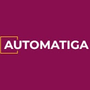
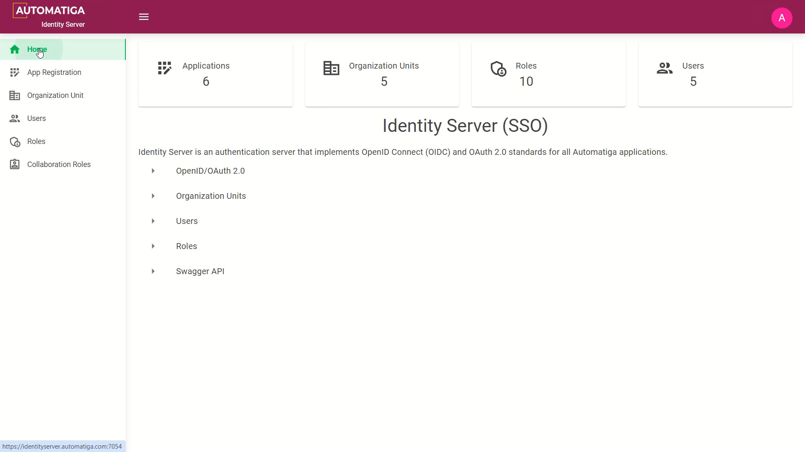
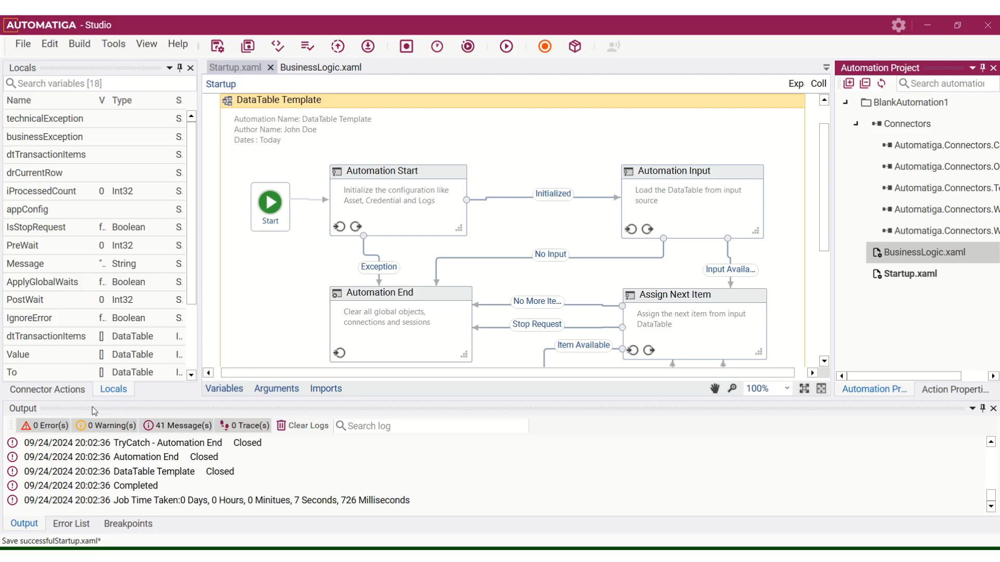
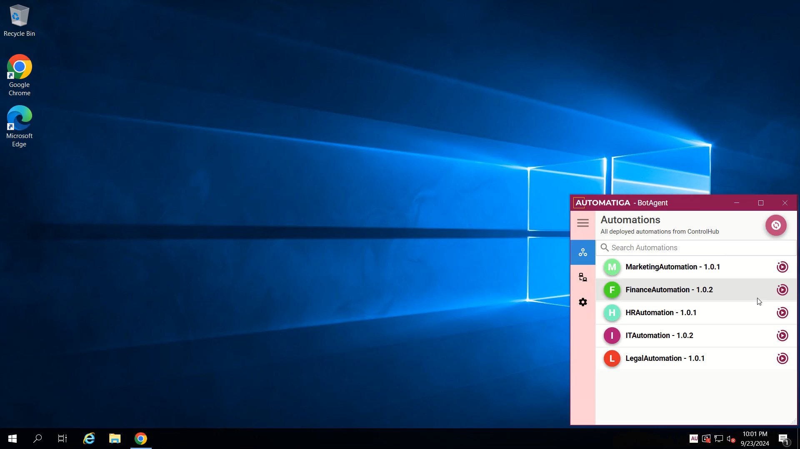
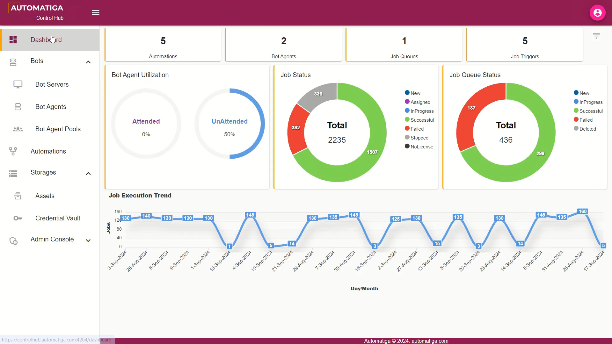
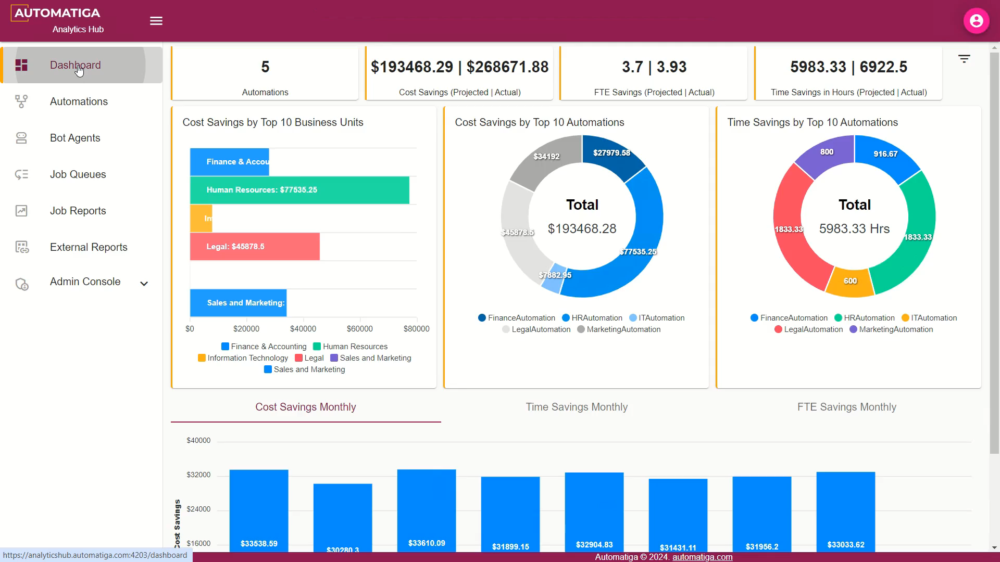
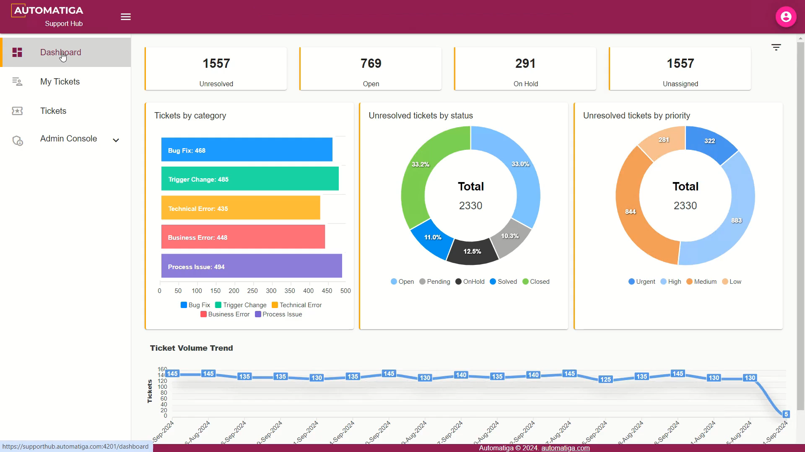

#  Automatiga - FREE RPA Platform.
Intelligent Automation Platform (RPA + AI)

<H2>Watch a Demo</H2>

<H2>Identity Server</H2>

<H2>Automation Studio</H2>

<H2>Bot Agent</H2>

<H2>Control Hub</H2>

<H2>Analytics Hub</H2>

<H2>Support Hub</H2>

<H2>System Specifications</H2>

Minimum requirement for the platform setup.

Automation Studio - Windows 10+, .Net Framework 4.8

Bot Agent - Windows 10+, .Net Framework 4.8

Automation Hub - Windows 10+ / Windows Server 2012+, .Net Core 8+, IIS Server

AI Hub - Windows 10+ / Windows Server 2012+, .Net Core 8+, IIS Server

Control Hub - Windows 10+ / Windows Server 2012+, .Net Core 8+, IIS Server

Analytics Hub - Windows 10+ / Windows Server 2012+, .Net Core 8+, IIS Server

Support Hub - Windows 10+ / Windows Server 2012+, .Net Core 8+, IIS Server

<H2>Download</H2>

[Downloads](https://automatiga.com/contact-us/)

<H2>Getting Started</H2>

[Getting Started](https://academy.automatiga.com/)

<H2>Contact Us</H2>

info@automatiga.com

