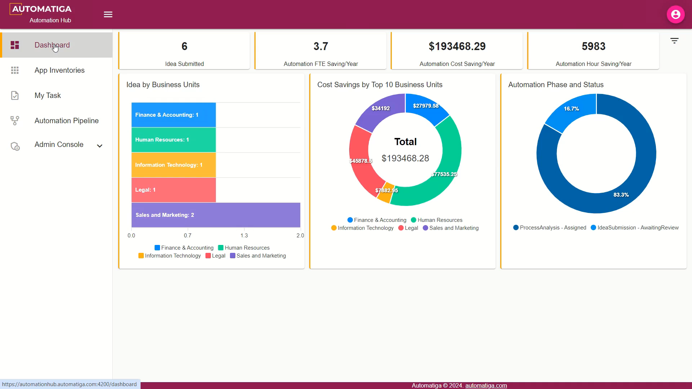

#  Automatiga - FREE RPA Platform.
Intelligent Automation Platform (RPA + AI)

<H2>About the product</H2>

Automatiga is an advanced Intelligent Automation Platform designed to revolutionize operational processes and drive significant cost savings. By harnessing the power of Robotic Process Automation (RPA) and AI technologies, this platform enables businesses to automate intricate tasks and use cases with speed and efficiency. It provides a suite of products to expedite and scale automation initiatives. Here is a list of our offerings:

<H2>Watch a Demo</H2>

<H2>Identity Server</H2>

Provides centralized authentication and access control across all Automatiga products.

<H2>Automation Hub</H2>

A centralized platform tailored for the Robotics Process Automation Centre of Excellence within organizations to drive process automation. It enables the capture and management of automation opportunities and process improvements, prioritized by impact and ROI.

<H2>Automation Studio</H2>

A desktop-integrated development environment designed for creating, editing, debugging, and publishing robotic process automation. It features graphical elements, such as a drag-and-drop interface, which requires no prior programming experience.

<H2>Bot Agent</H2>

Assist in performing repetitive tasks, allowing you to focus on more strategic and meaningful work. These digital workers execute the automation created in the studio.

<H2>Control Hub</H2>

Empowers you to provision, deploy, trigger, monitor, measure, and track the activities of both attended and unattended bot agents. 

<H2>Analytics Hub</H2>

Comprehensive web application designed to help businesses monitor, evaluate, and manage the performance of their automation processes.

<H2>Support Hub</H2>

Enables businesses to track, measure, and manage automation issues.

<H2>System Specifications</H2>

Minimum requirement for the platform setup.

Automation Studio - Windows 10+, .Net Framework 4.8

Bot Agent - Windows 10+, .Net Framework 4.8

Automation Hub - Windows 10+ / Windows Server 2012+, .Net Core 8+, IIS Server

AI Hub - Windows 10+ / Windows Server 2012+, .Net Core 8+, IIS Server

Control Hub - Windows 10+ / Windows Server 2012+, .Net Core 8+, IIS Server

Analytics Hub - Windows 10+ / Windows Server 2012+, .Net Core 8+, IIS Server

Support Hub - Windows 10+ / Windows Server 2012+, .Net Core 8+, IIS Server

<H2>Download</H2>

[Downloads](https://automatiga.com/contact-us/)

<H2>Getting Started</H2>

[Getting Started](https://academy.automatiga.com/)

<H2>Contact Us</H2>

info@automatiga.com

